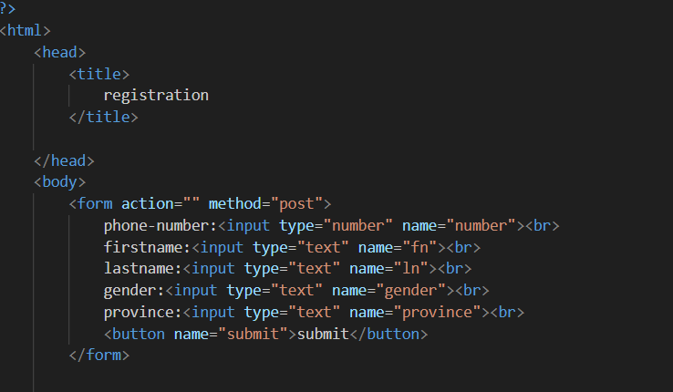
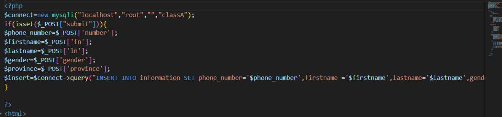
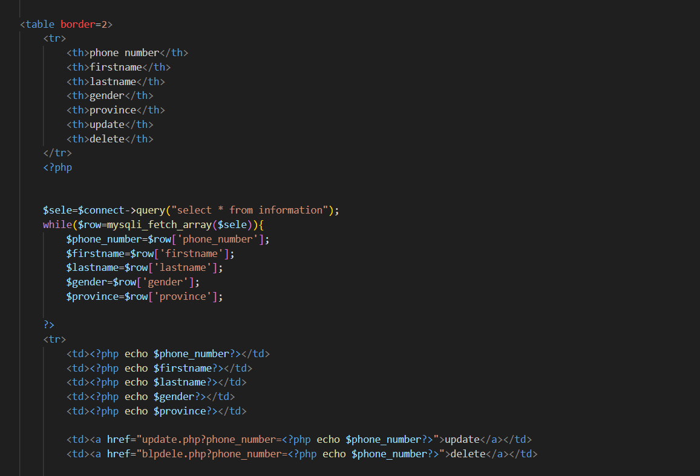
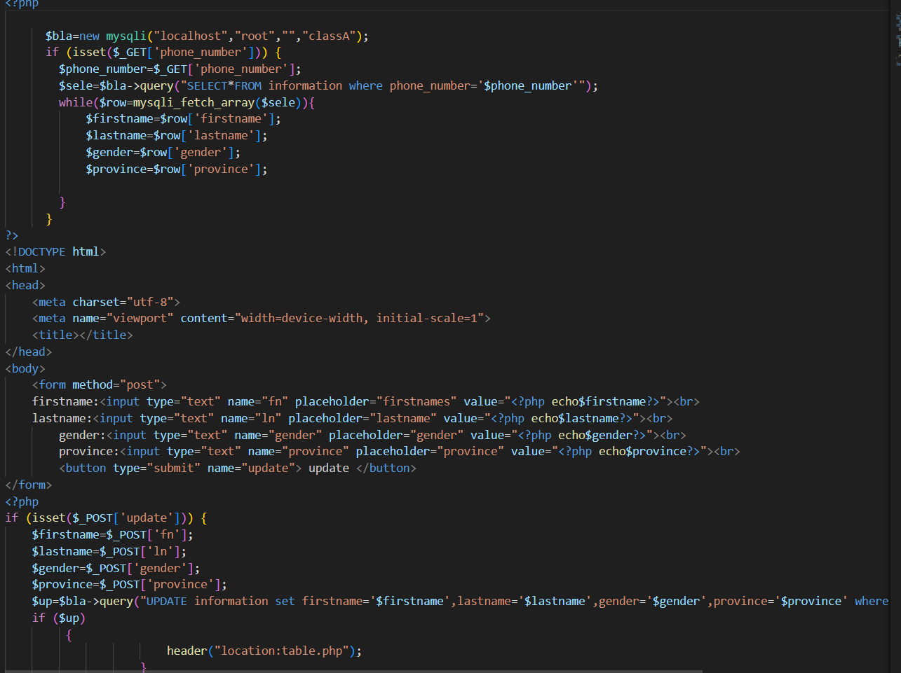

# crud-assignment
crud operation

project description 
we create a form for students ,requesting to enter phone_number,fistname, lastname,gender ,province.

creation of the form

and we are going to the part where he inputs data from the form and goes to the 

the part of the selection is also stated in this screenshot

the update part is also stated here

 
and the deletion part is
